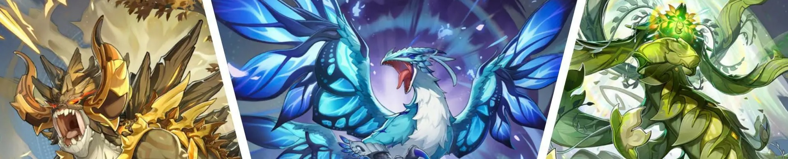

# RPyG

Este exercício tem como objetivo praticar os conceitos fundamentais da Programação Orientada a Objetos (POO) em Python e JS, utilizando um cenário de jogo de RPG (Role-Playing Game).



## Sumário
- [Objetivo Principal](#objetivo-principal)
- [Como Fazer um Pull Request](#como-fazer-um-pull-request)
- [Conceitos de POO Abordados](#conceitos-de-poo-abordados)
- [Estrutura das Classes](#estrutura-das-classes)
    - [Personagem](#personagem-classe-base)
        - [Herói](#heroi-subclasse-de-personagem)
        - [Monstro](#monstro-subclasse-de-personagem)
    - [Item](#item-classe-base)
        - [Arma](#arma-subclasse-de-item)
        - [Armadura](#armadura-subclasse-de-item)
- [Funcionalidades Extra](#funcionalidades-extra)

## Objetivo Principal
Traduzir as classes do jogo RPyG para o JS:
- Desenvolver as classes em JS nos arquivos `nome-da-classe.js` nas pastas `./itens` e `./personagens`;
- Implementar um teste das classes no arquivo `teste.js`;  
- Criar um menu para interação com o usuário no arquivo `RPyG.js`, possibilitando no mínimo:
    - Escolher um nome para o herói;
    - Iniciar batalha; (Aqui você pode ser criativo e fazer uma história complexa e interessante ou pode ser uma batalha simples, mas com no mínimo um monstro básico!)
    - Sair.

## Como Fazer um Pull Request

Para solucionar estes exercícios, siga os passos abaixo para fazer um Pull Request (PR):

1.  **Clone o Repositório**: No seu terminal, clone o repositório para a sua máquina local:
    ```bash
    git clone https://github.com/LeCEDUP/4INFO3-RPyG.git
    ```

2.  **Crie uma Nova Branch**: Navegue até o diretório do projeto e crie uma nova branch para suas alterações:
    ```bash
    git checkout -b TURMA-seunome
    ```

3.  **Faça Suas Primeiras Alterações**: Implemente alguma alteração inicial.

4.  **Adicione e Commite Suas Alterações**: Após fazer a alteração, adicione os arquivos modificados e faça um commit:
    ```bash
    git add .
    git commit -m "Adiciona solução x" # Use uma mensagem de commit descritiva
    ```

5.  **Envie Suas Alterações para o GitHub**: Envie sua nova branch para o repositório remoto:
    ```bash
    git push origin nome-da-sua-branch
    ```

6.  **Abra um Pull Request**: Vá até o repositório no GitHub. Você verá um botão "Compare & pull request" ou uma notificação para abrir um Pull Request da sua nova branch. Nomeie o seu PR com `[TURMA] Seu Nome` e envie.

7. **Continue Suas Alterações**: Implemente suas soluções para os exercícios, fazendo commits descritivos periódicamente(a cada atualização ou correção) e os envie ao github utilizado `git push`.

## Conceitos de POO Abordados

O código fornecido ilustra os seguintes pilares da POO:

*   **Classes e Objetos**: `Personagem`, `Heroi`, `Monstro`, `Item`, `Arma` e `Armadura` são classes que servem como moldes para criar objetos (instâncias) com características e comportamentos específicos.
*   **Encapsulamento**: Atributos como `nome`, `vida`, `ataque` e `defesa` são encapsulados dentro das classes, sendo acessados e modificados por métodos definidos na própria classe (ex: `receber_dano`).
*   **Herança**: A classe `Personagem` é uma classe base (superclasse) da qual `Heroi` e `Monstro` herdam atributos e métodos. Da mesma forma, `Arma` e `Armadura` herdam de `Item`. Isso promove a reutilização de código e a organização hierárquica.
*   **Polimorfismo**: Embora não explicitamente demonstrado com métodos sobrescritos de forma complexa, o conceito de polimorfismo é tangencialmente aplicado na forma como `Personagem` define métodos como `atacar` e `receber_dano`, que são comportamentos comuns a todos os tipos de personagens, sejam eles heróis ou monstros.

## Estrutura das Classes

### `Personagem` (Classe Base)

Representa qualquer entidade viva no jogo.

| Atributo | Descrição |
| :-------- | :-------- |
| `nome`    | Nome do personagem. |
| `vida`    | Pontos de vida atuais. |
| `ataque`  | Valor base de ataque. |
| `defesa`  | Valor base de defesa. |

| Método        | Descrição |
| :------------ | :-------- |
| `__init__`    | Construtor da classe. |
| `atacar(alvo)`| Calcula o dano e aplica ao alvo. |
| `receber_dano(dano)` | Reduz a vida do personagem e verifica se foi derrotado. |
| `esta_vivo()` | Retorna `True` se a vida for maior que 0, `False` caso contrário. |

### `Heroi` (Subclasse de `Personagem`)

Representa o personagem jogável, com habilidades de progressão e inventário.

| Atributo    | Descrição |
| :---------- | :-------- |
| `nivel`     | Nível atual do herói. |
| `experiencia` | Pontos de experiência acumulados. |
| `inventario`  | Lista de itens que o herói possui. |

| Método        | Descrição |
| :------------ | :-------- |
| `__init__`    | Construtor da classe, chamando o construtor da superclasse. |
| `ganhar_experiencia(exp)` | Adiciona experiência e verifica se o herói deve subir de nível. |
| `subir_nivel()` | Aumenta o nível e os atributos do herói. |
| `equipar_item(item)` | Equipa um item (arma ou armadura) do inventário, aumentando os atributos correspondentes. |

### `Monstro` (Subclasse de `Personagem`)

Representa os inimigos que o herói enfrentará.

| Atributo | Descrição |
| :------- | :-------- |
| `tipo`   | Tipo do monstro (ex: "Pequeno", "Grande"). |

| Método     | Descrição |
| :--------- | :-------- |
| `__init__` | Construtor da classe, chamando o construtor da superclasse. |

### `Item` (Classe Base)

Representa um item genérico no jogo.

| Atributo    | Descrição |
| :---------- | :-------- |
| `nome`      | Nome do item. |
| `descricao` | Descrição do item. |

| Método     | Descrição |
| :--------- | :-------- |
| `__init__` | Construtor da classe. |

### `Arma` (Subclasse de `Item`)

Representa uma arma que pode ser equipada.

| Atributo       | Descrição |
| :------------- | :-------- |
| `bonus_ataque` | Bônus de ataque que a arma concede. |

| Método     | Descrição |
| :--------- | :-------- |
| `__init__` | Construtor da classe, chamando o construtor da superclasse. |

### `Armadura` (Subclasse de `Item`)

Representa uma armadura que pode ser equipada.

| Atributo       | Descrição |
| :------------- | :-------- |
| `bonus_defesa` | Bônus de defesa que a armadura concede. |

| Método     | Descrição |
| :--------- | :-------- |
| `__init__` | Construtor da classe, chamando o construtor da superclasse. |

## Funcionalidades Extra

Para aprofundar seu conhecimento em POO e praticar o fluxo de trabalho Git/GitHub, além do [Objetivo Principal](#objetivo-principal), tente implementar algumas das seguintes funcionalidades:

1.  **Sistema de Magias**: Crie uma nova classe `Magia` (subclasse de `Item` ou uma nova hierarquia) e adicione um método `lancar_magia(alvo)` à classe `Heroi`. Pense em como diferentes tipos de magia (dano, cura, buff) poderiam ser representados.
2.  **Inventário Mais Complexo**: Implemente um sistema de inventário que tenha um limite de peso ou slots. O herói não poderia carregar infinitos itens.
3.  **Tipos de Dano/Defesa**: Adicione tipos de dano (físico, mágico, fogo, gelo) e resistências/fraquezas aos personagens. O cálculo de dano poderia levar isso em consideração.
4.  **Classes de Herói**: Crie subclasses de `Heroi` como `Guerreiro`, `Mago` e `Arqueiro`, cada uma com atributos iniciais e habilidades únicas.
5.  **Persistência de Dados**: Salve o estado do herói (vida, nível, inventário) em um arquivo (JSON, CSV ou um formato simples) para que o jogo possa ser continuado mais tarde.
